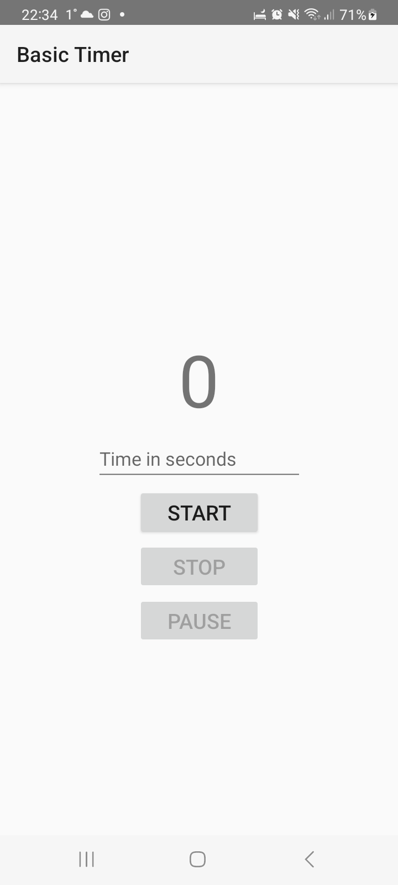

# Basic Timer

Простейший таймер, который использует возможности **LiveData/MutableLiveData** для отсчета.
Таймер можно запустить, приостановить, возобновить с остановленного времени, сбросить полностью. 
До нажатия Start кнопки сброса и паузы не активны.

  
  
  

